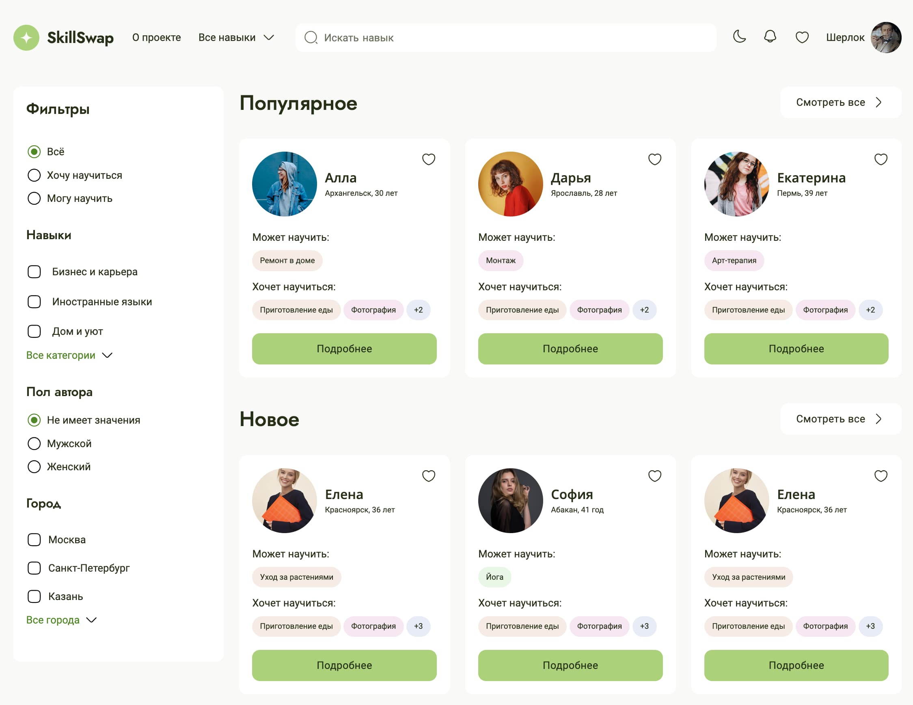
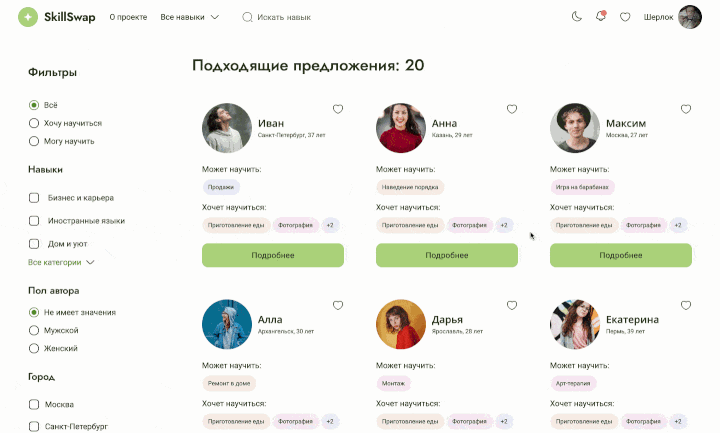
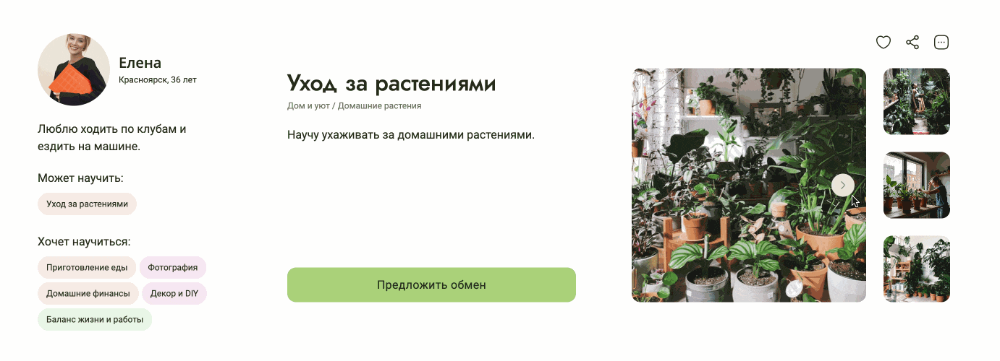
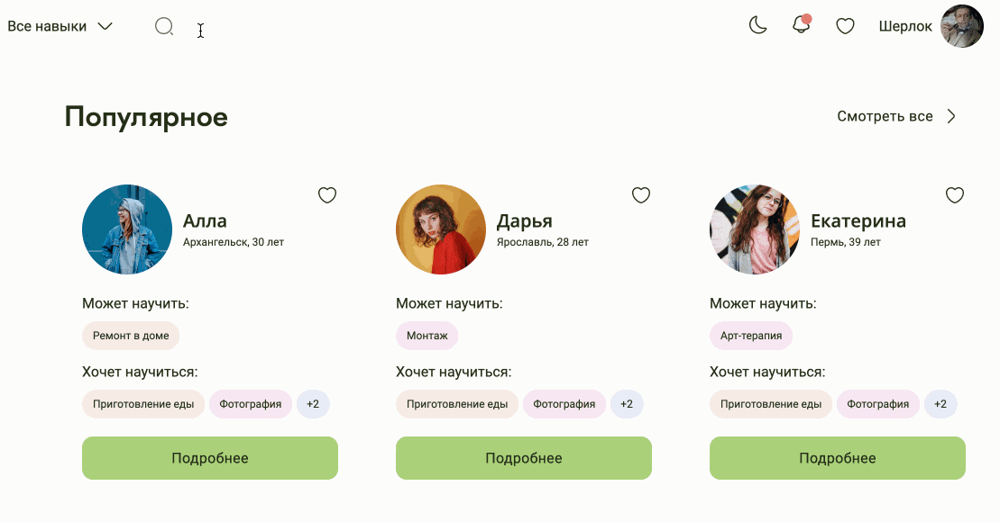
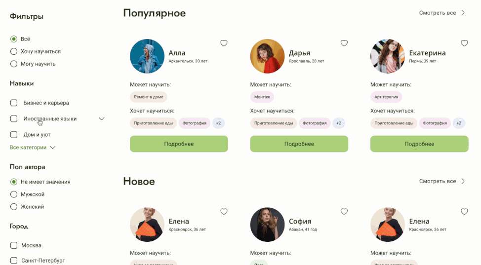
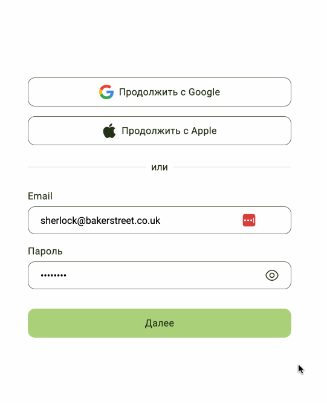
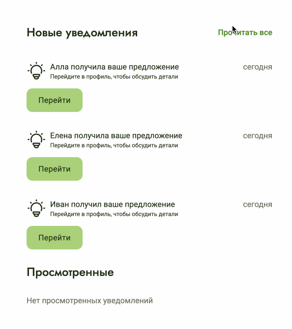

# SkillSwap — платформа для обмена навыками

SkillSwap — это учебный проект, созданный в рамках курса «Фронтенд-разработчик» от «Яндекс Практикума». Здесь пользователи могут предлагать обучение своим навыкам в обмен на навыки других пользователей.

 

 
 

  ## Технологии

 <table align="center">
  <tr>
    <td align="center">
       
      HTML5
    </td>
    <td align="center">
       
      SCSS
    </td>
    <td align="center">
       
      TypeScript
    </td>
   <td align="center">
       
      Vite
    </td>
   <td align="center">
       
      React
    </td>
   <td align="center">
       
      Redux
    </td>
  </tr>
</table>

## Особенности

- Прокрутка карточек с бесконечной подгрузкой с сервера

 

 
 

 - Просмотр подробных сведений о навыках с возможностью поставить лайк и предложить обмен

 

 
 

 - Текстовый поиск по навыкам

 

 
 

  - Фильтрация навыков по категориям, полу и городу

 

 
 

 - Регистрация и авторизация пользователей

 

 
 

 - Управление уведомлениями

 

 
 

## Запуск

- Установка зависимостей: `npm install`

- Запуск dev-сервера: `npm run dev`

- Запуск Storybook: `npm run storybook`

## Архитектура

В архитектуре проекта используются принципы FSD (Feature-Sliced Design).

- Слой `shared` содержит общие ресурсы, хуки, лэйауты, хэлперы, типы и компоненты интерфейса.

- Слой `entities` содержит слайсы `skill` и `user` с соответствующими компонентами интерфейса и слайсами хранилища.

- Слой `features` содержит слайсы авторизации, фильтрации, запросов и навыков.

- Слой `widgets` содержит слайсы шапки сайта, карточки и панели фильтров.

- Слой `pages` содержит страницы приложения.

- Слой `app` содержит `App.tsx`, стили и хранилище Redux.

## Задачи

Команде требовалось сделать с нуля MVP клиентской части приложения. Я осуществлял функции тимлида и выполнял следующие задачи.

- Настроил комплексное окружение разработки.

- Продумал архитектуру приложения.

- Формулировал задачи, декомпозировал требования и приоритизировал бэклог.

- Проводил код-ревью.

- Разработал моковый API на основе Local Storage.
